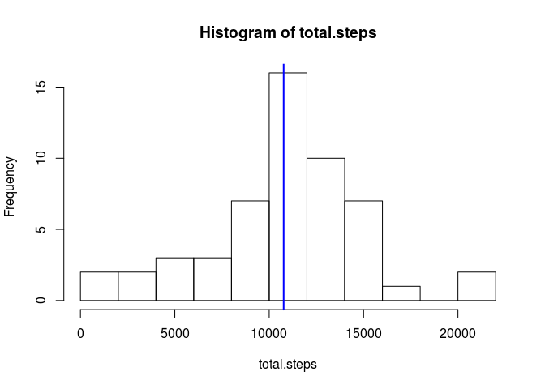
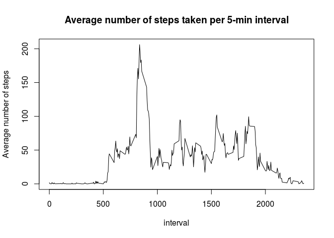
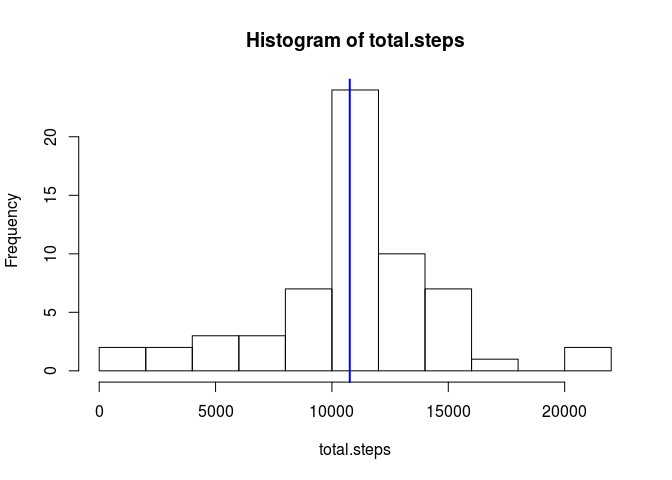
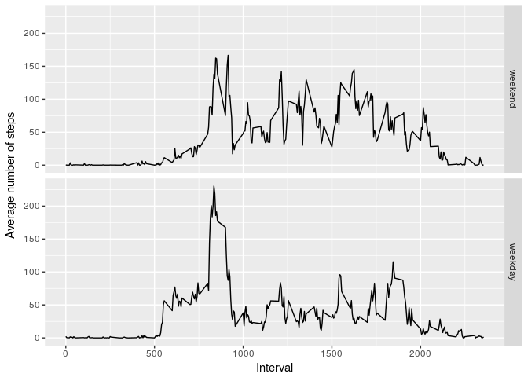

## Loading and preprocessing the data
Let's start by loading the data.

```r
    library(dplyr, warn.conflicts = FALSE)
    data <- tbl_df(read.csv(unzip("activity.zip"), stringsAsFactors = FALSE, na.strings = "NA"))
```

Let's transform the dates in the second column from character to date objects.

```r
    data <- tbl_df(transform(data, date = as.Date(date)))
    head(data, 3)
```

```
## # A tibble: 3 x 3
##   steps date       interval
##   <int> <date>        <int>
## 1    NA 2012-10-01        0
## 2    NA 2012-10-01        5
## 3    NA 2012-10-01       10
```
Great! Let's move on.

## What is mean total number of steps taken per day?
Let's get rid of the missing values and create a dataframe with the total number of steps per day. 

```r
    data2 <- data %>% filter(!is.na(steps)) %>% group_by(date) %>% 
             summarise(total.steps = sum(steps))
```
Make a histogram from this dataframe. 


```r
    with(data2, hist(total.steps, breaks = 10))
    abline(v = mean(data2$total.steps), lwd = 2, col = "blue")
```

<!-- -->

The vertical blue line represents the mean of the total number of steps taken per day. Rounding to the nearest integer we have:

```r
    # Mean
    as.integer(mean(data2$total.steps))
```

```
## [1] 10766
```

```r
    # Median
    as.integer(median(data2$total.steps))
```

```
## [1] 10765
```

showing a slight discrepancy between the mean and the median.

## What is the average daily activity pattern?
Let's group the data (with missing values removed) according to the interval, averaging accross the days.

```r
    data3 <- data %>% filter(!is.na(steps)) %>% group_by(interval) %>% 
             summarise(avg.steps = mean(steps))
```

Now let's plot this as a time series

```r
    with(data3, plot(interval, avg.steps, type = "l", xlab = "", ylab = ""))
    title(main = "Average number of steps taken per 5-min interval", xlab = "interval", 
          ylab = "Average number of steps")
```

<!-- -->

The interval where average number of steps is maximum is

```r
    as.numeric(data3[which(data3$avg.steps == max(data3$avg.steps)), 1])
```

```
## [1] 835
```

giving the peak at **206**.

## Imputing missing values
The total number of rows with missing values is

```r
    sum(is.na(data))
```

```
## [1] 2304
```

Let's build a data frame from the rows having missing values and fill these values with the average number of steps per interval calculated in data3

```r
    data_na <- data %>% filter(is.na(steps)) %>% merge(data3) %>% arrange(date,interval) %>%
               mutate(steps = avg.steps, date = date, interval = interval) %>%
               select(steps, date, interval)  
```

Since the rows in this dataframe are ordered first according to the date and then according to the interval (as in the original dataset), it can then be embeded into the original dataframe. We can then summarize the total number of steps from this new dataframe

```r
    data[which(is.na(data)), ] <- data_na
    data2_filled <- data %>% group_by(date) %>% summarise(total.steps = sum(steps))
```

Let's make a histogram now with this filled dataframe

```r
    with(data2_filled, hist(total.steps, breaks = 10))
    abline(v = mean(data2_filled$total.steps), lwd = 2, col = "blue")
```

<!-- -->

The mean and media calculated from this, are

```r
    # Mean
    as.integer(mean(data2_filled$total.steps))
```

```
## [1] 10766
```

```r
    # Median
    as.integer(median(data2_filled$total.steps))
```

```
## [1] 10766
```

It is observed now, that the mean and media are equal (within the rounding error) and that the frequency of counts have appreciably increased for total number of steps close to the mean (which makes sense, since we are filling missing values according to the mean across days). 

## Are there differences in activity patterns between weekdays and weekends?

Let's create a logical variable indicating if dates are weekdays or weekends. Convert this to a factor value and add as column to the filled dataframe.

```r
    is.weekday <- !grepl("S(at|un)", weekdays(data$date, abbr = TRUE))
    is.weekday <- factor(is.weekday, labels = c("weekend", "weekday"))
    data$is.weekday <- is.weekday
```
Let's make a panel plot containing a time series plot if the 5-minute interval (x-axis) and the average number of steps taken, averaged across all weekday days or weekend days (y-axis).

```r
    library(ggplot2)
    data4 <- tbl_df(data) %>% group_by(interval, is.weekday) %>%
             summarise(avg.steps = mean(steps))
    qplot(interval, avg.steps, data = data4, geom = "line", facets = is.weekday ~ ., 
          xlab = "Interval", ylab = "Average number of steps")
```

<!-- -->

Clearly, there are differences in activity pattern between weekdays and weekends. The average number of steps in the afternoon hours is greater on weekends than in weekdays, which makes sense since these coincide, for instance, with periods of activities generating entertainment, such as running in a park, playing sports, etc.
